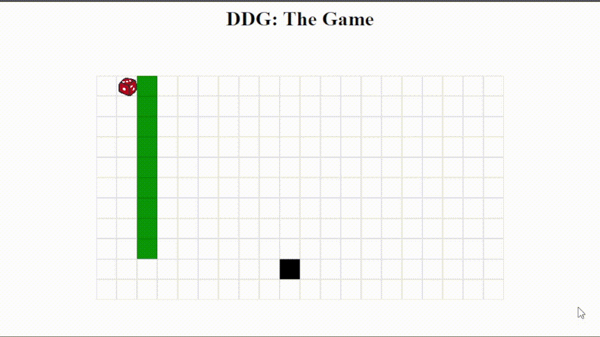
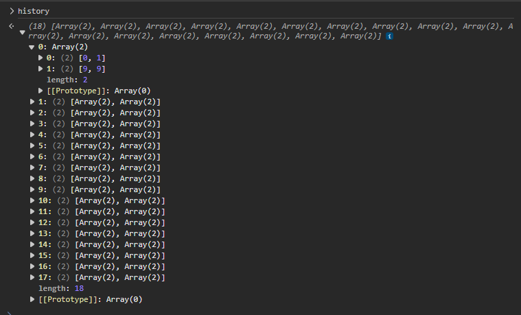
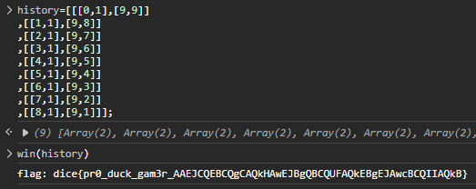

# dicedicegoose

in this challenge we have a game that looks like this



we can control the dice using W-S-A-D keys and the black square is randomly moves. and when the dice reach the black square a prompt ask for name and show the score which is the number of moves we make.

by looking into the [source code](challenge.html) we can see a long JavaScript code that is running the game. in that code we have a function called win

```javascript
    function win(history) {
    const code = encode(history) + ";" + prompt("Name?");

    const saveURL = location.origin + "?code=" + code;
    displaywrapper.classList.remove("hidden");

    const score = history.length;

    display.children[1].innerHTML = "Your score was: <b>" + score + "</b>";
    display.children[2].href =
        "https://twitter.com/intent/tweet?text=" +
        encodeURIComponent(
            "Can you beat my score of " + score + " in Dice Dice Goose?",
        ) +
        "&url=" +
        encodeURIComponent(saveURL);

    if (score === 9) log("flag: dice{pr0_duck_gam3r_" + encode(history) + "}");
}
```

the function take a parameter called `history` which is an array of the position of the dice and the black square each time we move the dice. so the length of `history` is the score.



`win` function test if `score === 9` and if its true print the flag witch combine include the the encoded `history`. and it's only triggers when the dice and the black square has the same y and x.
```javascript
    if (player[0] === goose[0] && player[1] === goose[1]) {
      win(history);
      won = true;
      return;
    }
```
so what we need to do is win the game with the score 9.

*LET'S MAKE OUR HISTORY LMAO*

first we set history to an array that solve the game and has a length of 9. the only solution is this array.

 `history = [[[0,1],[9,9]]
,[[1,1],[9,8]]
,[[2,1],[9,7]]
,[[3,1],[9,6]]
,[[4,1],[9,5]]
,[[5,1],[9,4]]
,[[6,1],[9,3]]
,[[7,1],[9,2]]
,[[8,1],[9,1]]]`

we can now use the browser console to run `win` function with the new `history` array.

and we got the flag


