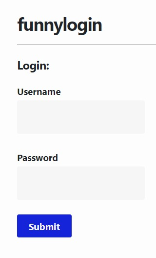
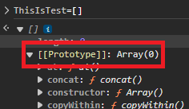
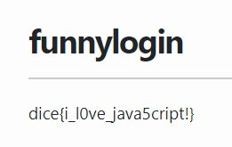

# funnyweb



in this challenge we have a simple login page. and this source file.

```javascript
const express = require('express');
const crypto = require('crypto');

const app = express();

const db = require('better-sqlite3')('db.sqlite3');
db.exec(`DROP TABLE IF EXISTS users;`);
db.exec(`CREATE TABLE users(
    id INTEGER PRIMARY KEY,
    username TEXT,
    password TEXT
);`);

const FLAG = process.env.FLAG || "dice{test_flag}";
const PORT = process.env.PORT || 3000;

const users = [...Array(100_000)].map(() => ({ user: `user-${crypto.randomUUID()}`, pass: crypto.randomBytes(8).toString("hex") }));
db.exec(`INSERT INTO users (id, username, password) VALUES ${users.map((u,i) => `(${i}, '${u.user}', '${u.pass}')`).join(", ")}`);

const isAdmin = {};
const newAdmin = users[Math.floor(Math.random() * users.length)];
isAdmin[newAdmin.user] = true;

app.use(express.urlencoded({ extended: false }));
app.use(express.static("public"));

app.post("/api/login", (req, res) => {
    const { user, pass } = req.body;

    const query = `SELECT id FROM users WHERE username = '${user}' AND password = '${pass}';`;
    try {
        const id = db.prepare(query).get()?.id;
        if (!id) {
            return res.redirect("/?message=Incorrect username or password");
        }

        if (users[id] && isAdmin[user]) {
            return res.redirect("/?flag=" + encodeURIComponent(FLAG));
        }
        return res.redirect("/?message=This system is currently only available to admins...");
    }
    catch {
        return res.redirect("/?message=Nice try...");
    }
});

app.listen(PORT, () => console.log(`web/funnylogin listening on port ${PORT}`));
```

let's break it down

1-create table called users with id, username and password attributes

```javascript
db.exec(`CREATE TABLE users(
    id INTEGER PRIMARY KEY,
    username TEXT,
    password TEXT
);`);
```

2-insert random 100000 user.
```javascript
const users = [...Array(100_000)].map(() => ({ user: `user-${crypto.randomUUID()}`, pass: crypto.randomBytes(8).toString("hex") }));
db.exec(`INSERT INTO users (id, username, password) VALUES ${users.map((u,i) => `(${i}, '${u.user}', '${u.pass}')`).join(", ")}`);
```

3-set a random user as an admin

```javascript
const isAdmin = {};
const newAdmin = users[Math.floor(Math.random() * users.length)];
isAdmin[newAdmin.user] = true;
```

4-get the username and password from the input, check the if the user id exists and if `isAdmin[user]==true` if both conditions are true redirect to the flag.

```javascript
app.post("/api/login", (req, res) => {
    const { user, pass } = req.body;

    const query = `SELECT id FROM users WHERE username = '${user}' AND password = '${pass}';`;
    try {
        const id = db.prepare(query).get()?.id;
        if (!id) {
            return res.redirect("/?message=Incorrect username or password");
        }

        if (users[id] && isAdmin[user]) {
            return res.redirect("/?flag=" + encodeURIComponent(FLAG));
        }
        return res.redirect("/?message=This system is currently only available to admins...");
    }
    catch {
        return res.redirect("/?message=Nice try...");
    }
});
```

first thing to notice is that there is no input control or sanitization before making sql query.

so we can inject sql query but the problem we don't know what user has isAdmin true because its random.

now the second trick comes into play. in JavaScript each Object has an attribute called `prototype`. you can read more [here](https://portswigger.net/web-security/prototype-pollution)



so if we set the username to `__prototype__` we will have `isAdmin[__prototype__]=true` and we can use SQL injection to bypass the password check.

now let's try it


`username: __prototype__`
`password: 1' or id=1; --`

and we got the flag:


